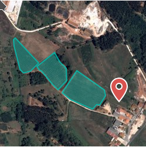

### Render static maps

This small package allows you to render static maps easly.

It uses svg to render the tiles and the vectors for the Polygon. You can specify a bounding box or if you pass any shape, it will automatically find the bounds for the shapes you want to add.

## Packages

- [*] @staticmaps/core
- [ ] @staticmaps/svelte
- [*] @staticmaps/react
- [ ] @staticmaps/vue
- [ ] @staticmaps/node
